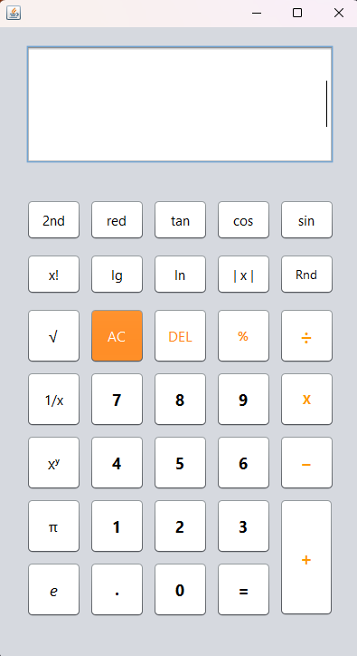
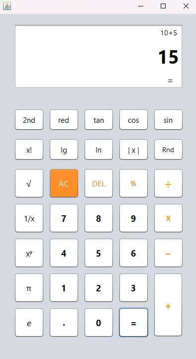
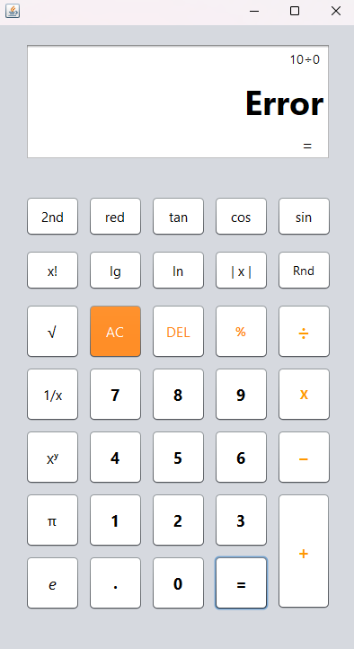

# CalcDesk

A clean Java Swing desktop calculator application built in NetBeans IDE.

## Overview

CalcDesk is a desktop calculator project developed using **Java Swing** and **NetBeans IDE**.
It provides a simple, responsive, and user-friendly interface for performing basic arithmetic operations.

This project was built to strengthen my understanding of:

* Java GUI development
* Event-driven programming
* Desktop application structure
* Input handling and validation

## Features

* Basic arithmetic operations
* Clear and reset functionality
* Decimal number support
* Button-based graphical interface
* Responsive layout
* Error handling for invalid input

## Tech Stack

* Java
* Swing
* NetBeans IDE

## Screenshots

Add clean screenshots in the `screenshots/` folder and reference them here.

### 1. Main Interface

A full-window screenshot showing the complete calculator layout.

### 2. Calculation Example

A screenshot showing a real calculation in progress, such as `12 + 8 = 20`.

### 3. Error Handling

A screenshot showing how the application responds to invalid input or divide-by-zero, if supported.

Example:

```md



```

## Project Structure

```bash
calcdesk/
├── src/
├── screenshots/
├── README.md
└── .gitignore
```

## How It Works

1. The user enters numbers using the calculator buttons.
2. The selected operation is stored.
3. Pressing `=` triggers the calculation.
4. The result is displayed on the screen.

## How to Run

1. Clone the repository:

   ```bash
   git clone https://github.com/your-username/calcdesk.git
   ```

2. Open the project in **NetBeans IDE**.

3. Build and run the project.

4. Use the calculator interface to perform calculations.

## Learning Outcome

Through this project, I improved my understanding of:

* Java Swing components
* Action listeners and event handling
* GUI layout design
* Program flow and validation
* Debugging in NetBeans

## Future Improvements

Possible future upgrades:

* Scientific calculator functions
* Calculation history
* Keyboard input support
* Dark mode UI
* Better visual polish

## Author

**Abdur Rahman**

## License

This project is shared for educational and portfolio purposes.
